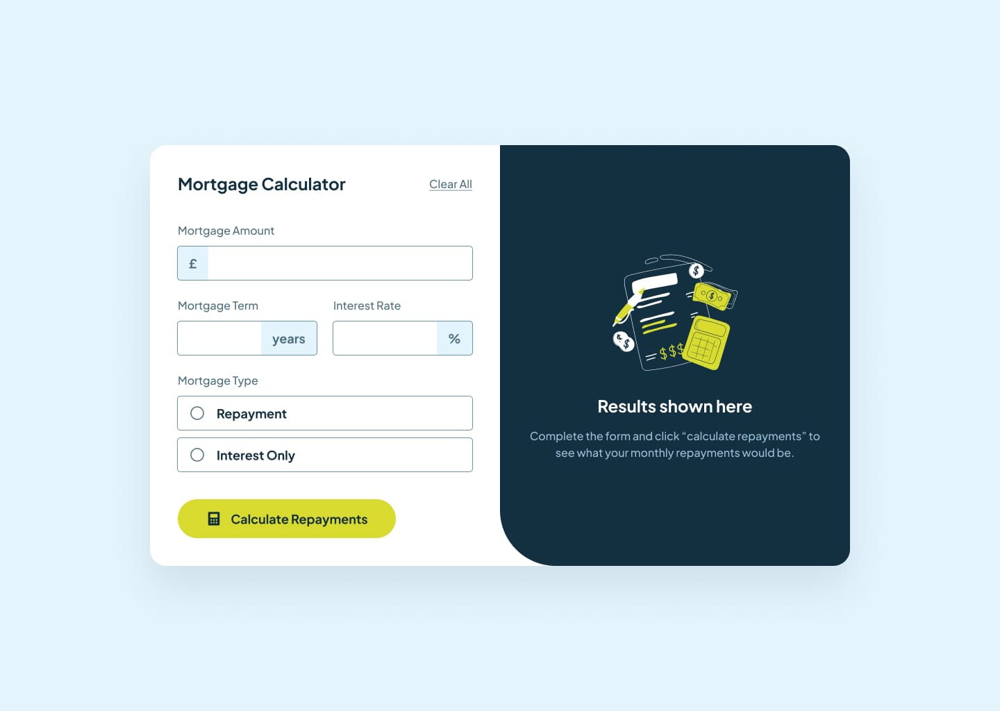

# React Mortgage Repayment Calculator App

This is a responsive Mortgage Repayment Calculator application built with React. It's a solution to the "Mortgage Repayment Calculator challenge" from Frontend Mentor. This application allows users to calculate their monthly and total mortgage repayments based on the loan amount, interest rate, and loan term.

* * *

## Features

*   **Calculate Repayments:** Input mortgage information (amount, term, and interest rate) to see the monthly and total repayment amounts.
    
*   **Form Validation:** Receive clear validation messages if any of the form fields are left incomplete or have invalid entries.
    
*   **Keyboard Friendly:** The entire form can be completed using only a keyboard for enhanced accessibility.
    
*   **Responsive Design:** The layout is optimized to provide the best viewing experience across a wide range of devices, from mobile phones to desktop computers.
    
*   **Interactive Elements:** All interactive elements on the page have distinct hover and focus states.
    
*   **Clear All:** A "Clear All" button is provided to easily reset the form and start over.
    

* * *

## Technologies Used

This project was built with a modern tech stack, including:

*   **React:** A JavaScript library for building user interfaces.
    
*   **JSX:** A syntax extension for JavaScript that makes it easier to write React components.
    
*   **Tailwind CSS:** A utility-first CSS framework for rapid UI development.
    
*   **React Hook Form:** A library for managing forms in React with a focus on performance and ease of use.
    
*   **Google Fonts:** For typography.
    

* * *

### Screenshot -

* * *

## Getting Started

To get a local copy up and running, follow these simple steps.

### Prerequisites

You'll need to have Node.js and npm (or yarn) installed on your machine.

### Installation

1.  Clone the repo
    
    Bash
    
        git clone https://github.com/sameermandve/React-Mortgage-Repayment-Calculator-App.git
    
2.  Install NPM packages
    
    Bash
    
        npm install
    
3.  Run the app
    
    Bash
    
        npm start
    

* * *

## Acknowledgments

*   This project is a solution to a challenge from [Frontend Mentor](https://www.frontendmentor.io/).
